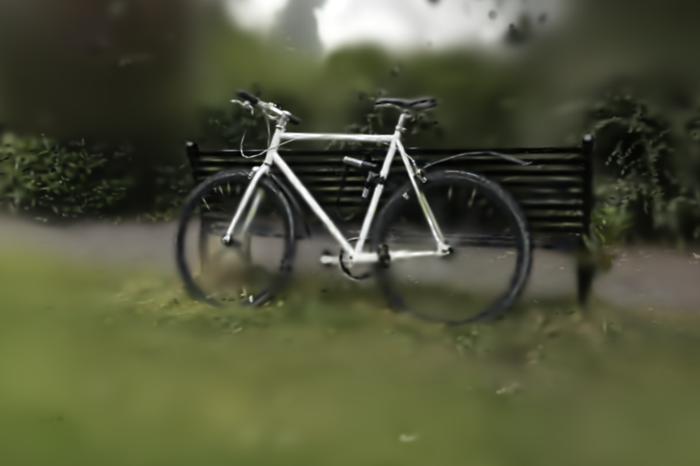

# API

## Loading COLMAP dataset

GaussianSplatting.jl supports datasets in **binary** COLMAP format.
To load it, you specify which GPU backend to use and a path to the dataset root directory.

```julia
import GaussianSplatting as GPS

kab = GSP.gpu_backend()
dataset_path = "<path-to-colmap-dataset>"
dataset = GSP.ColmapDataset(kab, dataset_path;
    scale=4, train_test_split=0.9, permute=true)
```

- `scale::Int = 1` controls the scale of images to load (usually between `1` an `8`).
- `train_test_split::Real = 0.8` train/test ratio split.
    E.g. `0.8` will select `80%` of the data for training and `20%` for testing.
- `permute::Bool = true` whether to shuffle data in a random order.

Dataset directory should have the following structure:
```
- sparse/0/cameras.bin
- sparse/0/images.bin
- sparse/0/points3D.bin
- images/
```

Additionally, if setting `scale > 1`, following directories should exist:
```
- images_<scale>/
```

## Initializing Gaussians from dataset

Once you load the dataset, you can initialize Gaussian model from it by
providing an array of `points` (means), their `colors` and `scales`.

```julia
gaussians = GSP.GaussianModel(
    dataset.points, dataset.colors, dataset.scales;
    max_sh_degree=3)
```

- `max_sh_degree::Int = 3` set the **maximum** allowed spherical-harmonics degree.
    For a given degree `d`, each gaussian will have `(d + 1)^2` color features.
    Set `0` to disable it. This will be used by during training to limit
    current spherical-harmonics degree.

## Rendering Gaussians

To render Gaussians, we first need to initialize rasterizer on the given GPU backend:

```julia
kab = GSP.gpu_backend()
rasterizer = GSP.GaussianRasterizer(kab; width=1280, height=720, mode=:rgb)
```

- `width::Int` and `height::Int` control the rendering resolution of the
    rasterizer.
- `mode::Symbol = :rgb` set the rendering mode.
    Either `:rgb` or `:rgbd` (RGB + depth) is supported for now.

Once constructed, we can rasterize gaussians onto the image plane given `camera`
that determines the position from which to render:

```julia
image_features = rasterizer(
    gaussians.points, gaussians.opacities, gaussians.scales,
    gaussians.rotations, gaussians.features_dc, gaussians.features_rest;
    camera, gaussians.sh_degree)
```

Depending on the `mode`, `image_features` will be either in `3xWxH` shape (`:rgb` mode)
or in `4xWxH` (`:rgbd` mode).

We can save it to disk (first transferring it from GPU to host):

```julia
using FileIO, ImageIO

host_image_features = Array(image_features)
save("image.png", GSP.to_image(@view(host_image_features[1:3, :, :])))
```

If the rasterizer is in `:rgbd` mode, we can also save the resulting depth map:
```julia
if rasterizer.mode == :rgbd
    depth_image = permutedims(@view(host_image_features[4, :, :]), (2, 1))
    depth_image ./= 50f0 # maximum(depth_image)
    clamp01!(depth_image)
    save("depth.png", colorview(Gray, depth_image))
end
```

Example of rendering gaussians (bicycle dataset after 400 training steps):

|RGB|Depth|
|:---:|:---:|
|||

## Training Gaussians

GaussianSplatting.jl implements a `Trainer` that handles training routines
such as loss computation, gradient update, model densification/pruning.

To construct a trainer pass:
- `gaussians::GaussianModel` that you want to train,
- `rasterizer::GaussianRasterizer` which it will use for rendering,
- `dataset::ColmapDataset` on which to train,
- `opt_params::OptimizationParams` that control learning rate (and its decay),
  densification and SSIM loss weighting.

```julia
opt_params = GSP.OptimizationParams() # Use default parameters.
trainer = GSP.Trainer(rasterizer, gaussians, dataset, opt_params)
```

To perform a single optimization step, just call `step!` on a trainer.
```julia
loss = step!(trainer)
```

If the dataset contains test data (e.g. `train_test_split < 1`),
you can call `validate` to obtain validation metrics (SSIM, MSE, PSNR)
accross test data:
```julia
(; eval_ssim, eval_mse, eval_psnr) = validate(trainer)
```
